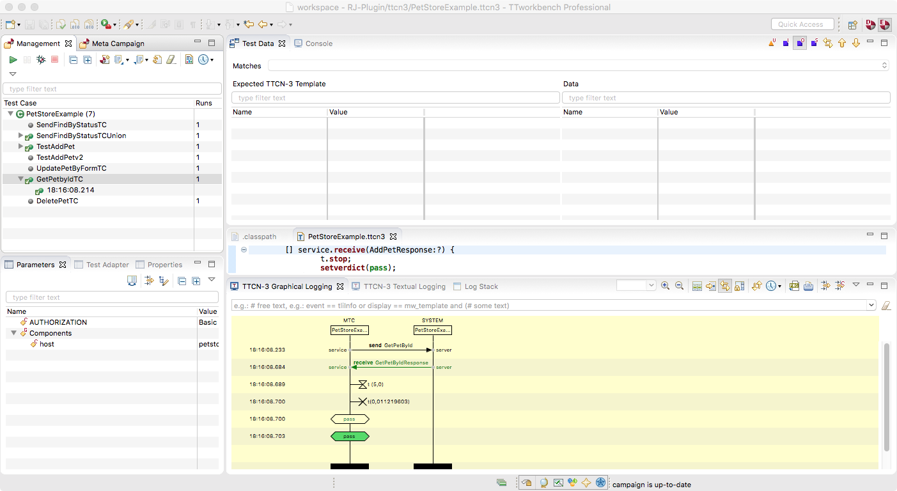
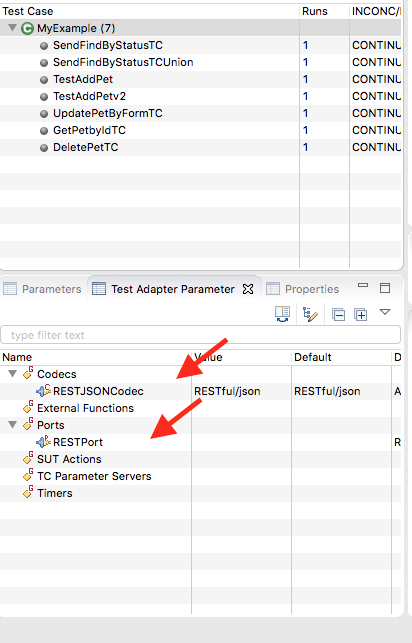

# Installation

## Source Installation - Recommended

Currently we only support installation from source. This means that use the RJ-Plugin in you TTCN-3 project you have 
to install it in your workspace.


### Step 1 - Clone Repository

There a several ways on how to clone the repository. Assuming that you have git installed on your computer run and you would like to
checkout the github repo at `$(CODING)`. 

```
cd $(CODING)
git clone https://github.com/theovassiliou/REST-Plugins.git
```

This creates you a folder named `REST-Plugins\`.
Within this folder there is the `RJ-Plugins` project folder. This TTworkbench project contains our `RJ-Plugin`. 

### Step 2 - TTworkbench workspace

Start TTworkbench and open a/your workspace. 


### Step 3 - Import REST-Plugins project folder into workspace

In TTworkbench:

	Import -> Existing Projects into Workspace
		Select root directory: $(CODING)/REST-Plugins/RJ-Plugin
	
### Step 4 - Initial check your installation in TTworkbench

In TTworkbench-TTCN Development View:

	Open File (double-click): `ttcn3/PetStoreExample.ttcn3`
	Run->Build
	This creates a new folder `clf/` that contains a TTworkbench campaig-loader file.
	Open File (double-click): `clf/PetStoreExample.clf`
	This opens the TTCN-3 Execution Management
	Select and Run a test case by double-clicking

You should something like 

### Step 5 - Create own TTCN-3 project

In TTworkbench-TTCN Development View:

Create a new TTCN_3 project	
	
	New TTCN-3 Project: TestPetProject
	Next -> Compiler Tab
		Select: Generate a default test campaign
		Select: Use arbitrary large integer values
	Next ->
	Projects Tab: Classpath : Add ... RJ-Plugin
	Finish ->

You have just created a TTCN-3 project that can make use of the `RJ-Plugin`. Now let's try to run your own tests. 
As an example we try to run the example test cases, provided by the `RJ-Plugin` in our newly created TTCN-3 project. Thus 
	
	Copy RJ-Plugin/ttcn3/PetStoreExample.ttcn3 from  to TestPetProject/ttcn3/	

Due to the fact that TTCN-3 works on modules not on files, you can not have two TTCN-3 modules with the same name. Therefore we have to rename the new module.

	Rename module, filename and module name, e.g. MyExample(.ttcn3)
Files names, are not relevant to TTCN-3. However it is considered best practise that a files contains only one TTCN-3 module, and the file name has the module name. 

We would like to generate a Campaign-Load-File (CLF) with every build step, automatically. Thus

	Right click on MyExample.ttcn3 -> TTCN-3 Source -> Configure As Main Module
	Build TTCN-3 module

The CLF contains all test cases of the TTCN-3 module, provides a way to parameterize the test suites (the TTCN-3 `modulepar`), *and* it contains configuration information for the execution of the test suite. In other words, in the CLF we defines which port implementations (or port plugins) and which codecs (or codec plugins) should be used. Thus

	Open created campaign loader file
	Confirm "Adapter confiugration file does not exist. Create a default one?" with "Yes"
	Select: "Test Adapter" Tab
	Double-Click: Codecs
		Add ... -> Select REST/JSON Codec
				   Select Encoding: RESTful/json
				   Select CheckMark
		Select Ports Tab
			Port Provider Add ... Select "REST Port"
		    Select CheckMark
			Finish

Your test adapter parameterization should now look like 

Now if everything was configured correctly you can run your own test cases 
			
	Run Test Case

### Done

Now you know which steps are required to write and run your own TTCN-3 test suites while using the RJ-Plugin. Take a look at the example test suite. In particular consult the different parts of the modules

- Operations: This group contains the TTCN-3 mapped API operations of the pet store
- Models: This group contains the data types to model the pet store data. Basically the `definitions` section of the swagger API
- Components: This group contains basically the definitions on the port definition. Of particular interest is the port definition and the used encoding parameter "RESTful"
